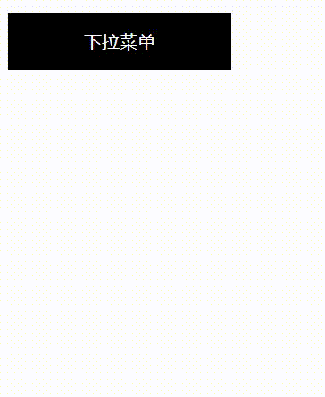

```html
<!DOCTYPE html>
<html lang="en">
  <head>
    <meta charset="UTF-8" />
    <meta http-equiv="X-UA-Compatible" content="IE=edge" />
    <meta name="viewport" content="width=device-width, initial-scale=1.0" />
    <title>下拉菜单</title>
    <style>
      ul {
        margin: 0;
        padding: 0;
      }
      .dropdown {
        width: 200px;
        height: 50px;
        background-color: #000;
        text-align: center;
        position: relative;
      }
      /*       .dropdown:hover .list {
        display: block;
      } */
      .title {
        height: 100%;
        line-height: 50px;
      }
      .dropdown a {
        text-decoration: none;
        color: #fff;
        display: block;
      }
      .dropdown li {
        list-style: none;
      }
      .list {
        height: 0;
        overflow: hidden;
      }
      .item {
        background-color: lightslategray;
        padding: 10px;
      }
      .dropdown .item:hover {
        background-color: #000;
      }
    </style>
  </head>
  <body>
    <div class="dropdown">
      <a href="" class="title">下拉菜单</a>
      <ul class="list">
        <li class="item"><a href="">第1个项目</a></li>
        <li class="item"><a href="">第2个项目</a></li>
        <li class="item"><a href="">第3个项目</a></li>
        <li class="item"><a href="">第4个项目</a></li>
        <li class="item"><a href="">第5个项目</a></li>
      </ul>
    </div>
    <script type="text/javascript">
      var title = document.getElementsByClassName("title")[0],
        list = document.getElementsByClassName("list")[0],
        dropdown = document.getElementsByClassName("dropdown")[0],
        curHeight = 0, // 菜单的初始高度
        speed = 5, // 下拉菜单展开和关闭的速度
        timer = null; // 定时器
      
      // 实现二级菜单渐入效果
      /**
       * 绑定mouseenter
       * 有一种情况：在菜单还没完全展开的时候，就移出，导致画面抖动：在一开始就清除定时器
       */
      //  title.addEventListener("mouseenter", enterCallBack.bind(title), false);
      dropdown.onmouseenter = function (e) {
        clearInterval(timer);
        timer = setInterval(function () {
          if (curHeight >= 200) {
            clearInterval(timer);
          } else {
            curHeight = parseInt(getStyle(list, "height")) + speed;
            list.style.height = curHeight + "px";
          }
        }, 1);
      };
      dropdown.onmouseleave = function () {
          clearInterval(timer)
        timer = setInterval(function () {
          if (curHeight <= 0) {
            clearInterval(timer);
          } else {
            curHeight = parseInt(getStyle(list, "height")) - speed;
            list.style.height = curHeight + "px";
          }
        }, 1);
      };
                            
      //  获取计算属性的兼容性封装
      function getStyle(node, prop) {
        if (window.getComputedStyle) {
          if (prop) {
            return window.getComputedStyle(node)[prop];
          }
        } else {
          return node.getCurrentStyle(node)[prop];
        }
      }
    </script>
  </body>
</html>


```

